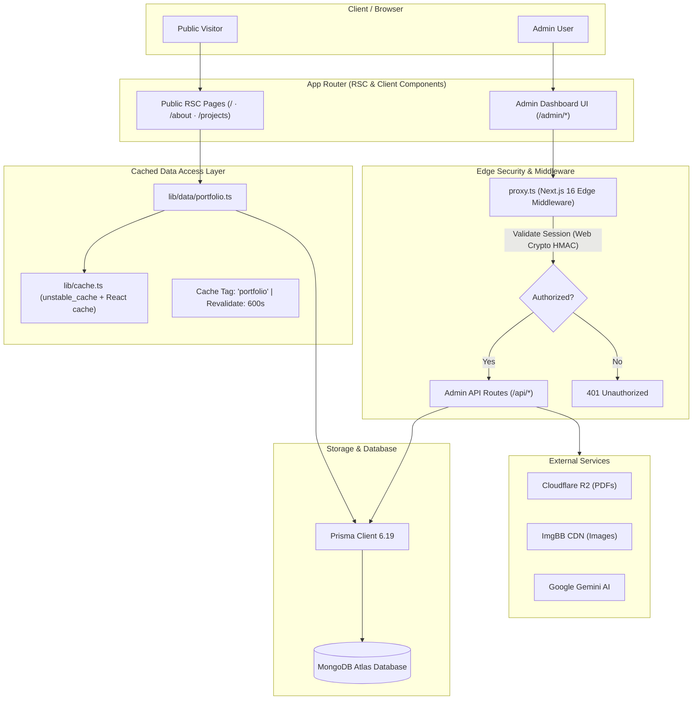

<div align="center">

# Portfolio & Content Engine

### A high-performance, database-driven developer portfolio with an integrated headless CMS dashboard.

[](https://murshedkoli.com)
[](https://murshedkoli.com/admin)

<br/>

[-000000?style=flat-square&logo=nextdotjs&logoColor=white)](https://nextjs.org/)
[](https://react.dev/)
[-3178C6?style=flat-square&logo=typescript&logoColor=white)](https://www.typescriptlang.org/)
[](https://www.prisma.io/)
[](https://www.mongodb.com/)
[](https://tailwindcss.com/)
[](https://ai.google.dev/)
[](https://vercel.com/)

</div>

---

## 📑 Table of Contents

- [Overview](#-overview)
- [System Architecture](#-system-architecture)
- [Key Features](#-key-features)
  - [Editorial Front-End](#editorial-front-end)
  - [Headless CMS & Back Office](#headless-cms--back-office)
  - [AI & PDF Automation Pipelines](#ai--pdf-automation-pipelines)
- [Technology Stack](#-technology-stack)
- [Project Structure](#-project-structure)
- [Data Model & Database Schema](#-data-model--database-schema)
- [API Route Specification](#-api-route-specification)
- [Security & Authentication](#-security--authentication)
- [Performance & Optimization](#-performance--optimization)
- [Getting Started](#-getting-started)
  - [Prerequisites](#prerequisites)
  - [Installation & Environment](#installation--environment)
  - [Database Setup & Seeding](#database-setup--seeding)
  - [Development Scripts](#development-scripts)
- [Deployment Guide](#-deployment-guide)
- [Engineering Decisions & Gotchas](#-engineering-decisions--gotchas)
- [Author & License](#-author--license)

---

## 💡 Overview

Most developer portfolios are static templates requiring code modifications and redeployments for every update. This repository houses an **enterprise-grade, production-tested personal portfolio coupled with a dedicated back-office Content Management System (CMS)**.

Every line of text, asset, case study, and timeline entry is persisted in **MongoDB Atlas** and managed via an authenticated `/admin` suite. Changes propagate to the public site through an **Incremental Static Regeneration (ISR)** caching layer without triggering full site rebuilds.

---

## 🏛 System Architecture

The application enforces strict separation of concerns between presentation, data access, and mutation layers:



### Architectural Highlights

1. **Decoupled Data Access**: Public Server Components never query Prisma directly. They read through `lib/data/portfolio.ts`, which maps raw MongoDB documents into slim, strongly-typed view models (`FeaturedProject`, `TimelineEntry`, `SkillColumn`).
2. **Two-Tier Caching**: Read queries are wrapped with `lib/cache.ts`, leveraging Next.js `unstable_cache` across requests and React's `cache()` deduplication within a single render cycle.
3. **Defense-in-Depth Authorization**: Non-safe HTTP methods on `/api/*` are guarded at the Edge by `proxy.ts`, while mutating route handlers independently enforce `requireAdmin()`.

---

## ✨ Key Features

### Editorial Front-End
- **Dark Editorial Aesthetic**: Bespoke dark theme built with OKLCH color tokens, `#f5b04c` warm amber accents, hairline structural rules, and fluid typography (`clamp()`).
- **Scroll-Scrubbed Portrait Background**: A 100-frame WebP sequence rendered onto a fixed `<canvas>`, scrubbed continuously with scroll depth and synchronized with subtle viewport zoom.
- **Zero-Flicker Theming**: Anti-flicker inline pre-paint script coupled with a client `ThemeProvider` and animated theme toggle.
- **Accessible Micro-Interactions**: Framer Motion entrance reveals and scroll-linked transforms that gracefully collapse under `prefers-reduced-motion`.
- **Rich Case Studies**: Dynamic `/projects/[slug]` detail views featuring responsive image grids, metadata spec-sheets, and a keyboard/swipe accessible lightbox.
- **LLM-Friendly**: Serves a structured `/llms.txt` endpoint providing machine-readable portfolio information for AI agents and scrapers.

### Headless CMS & Back Office
- **Comprehensive Admin Suite (`/admin`)**: 12 dedicated administration modules:
  - **Projects**: Tabbed editor covering identity, tech stack categorizer, live URLs, feature roadmaps, architecture flow diagrams, and GitHub repository importer.
  - **Skills & Services**: Categorized skill management with proficiency sliders and feature status toggles.
  - **Experience & Education**: Timeline sequencing with date ranges, bullet points, and current position flags.
  - **Certifications**: Integrated upload pipeline supporting image and PDF certificates.
  - **Inbound Inquiries**: Contact message management with read/replied status tracking.
  - **Personal Trackers**: Custom dashboards for travel tracking (`TourLocation`) and personal finance accounts (`SavingsAccount`).

### AI & PDF Automation Pipelines
- **AI Assist**: Field-level generation powered by Google Gemini (`@google/genai`) with automatic fallback to OpenRouter for drafting project summaries, SEO descriptions, and case study outcomes.
- **PDF 1st-Page Thumbnailing**: Server-side rasterization via `pdfjs-dist` converts the first page of uploaded certificate PDFs into web-ready preview images upon upload.
- **Dynamic Résumé Generation**: `/api/resume` generates an up-to-date PDF résumé on demand from database content using `pdf-lib`.

---

## 🛠 Technology Stack

| Layer | Technology | Version | Purpose |
|---|---|---|---|
| **Framework** | Next.js | `16.2.0` | App Router, Server Components, Route Handlers, Turbopack |
| **Language** | TypeScript | `5.x` | Strict type safety across database schemas, APIs, and UI |
| **Runtime / UI** | React / React DOM | `18.x` | Modern component architecture, React Server Components |
| **Styling** | Tailwind CSS | `3.3.6` | Utility-first CSS with OKLCH CSS variables |
| **Database ORM** | Prisma | `6.19.3` | Schema definition, migrations, and typed client generation |
| **Database Engine**| MongoDB Atlas | `6.x` | Multi-document distributed NoSQL store |
| **Validation** | Zod | `4.3.6` | Runtime payload and API schema validation |
| **Animations** | Framer Motion | `10.16.16` | Viewport reveals and layout transitions |
| **AI Integration** | `@google/genai` | `1.50.1` | Google Gemini API for automated content drafting |
| **PDF Processing** | `pdf-lib` / `pdfjs-dist` | `1.17` / `6.2` | Vector PDF construction and raster thumbnailing |
| **Icons** | Lucide React | `0.294.0` | Minimalist stroke icon system |
| **Notifications** | Sonner | `2.0.7` | Accessible toast notification system |

---

## 📂 Project Structure

```
portfolio/
├── app/
│   ├── (public)
│   │   ├── page.tsx                     # Editorial homepage
│   │   ├── about/page.tsx               # Biography, philosophy & timeline
│   │   ├── projects/                    # Project catalog & [slug] case studies
│   │   ├── llms.txt/route.ts            # Machine-readable profile for AI crawlers
│   │   ├── robots.ts & sitemap.ts       # Automated SEO indexing feeds
│   │   └── layout.tsx                   # Root layout, fonts, and theme providers
│   ├── admin/                           # Authenticated back office
│   │   ├── page.tsx & layout.tsx        # Dashboard shell & navigation
│   │   ├── projects/                    # Project table, wizard, and editor
│   │   ├── skills/ & services/          # Capability management
│   │   ├── experience/ & education/     # Career history editors
│   │   ├── certificates/                # Credential management & PDF rasterizer
│   │   ├── messages/                    # Inbound contact form submissions
│   │   ├── savings/ & tour/             # Personal tracking dashboards
│   │   └── admin.css                    # Scoped styles for admin dashboard
│   ├── api/                             # REST route handlers (Zod-validated)
│   └── styles/
│       └── tokens.css                   # OKLCH design system tokens
│
├── components/
│   ├── site/                            # Public-facing components
│   │   ├── home/                        # Hero, Projects, Timeline, Skills, Services
│   │   ├── projects/                    # Lightbox, gallery, spec sheets
│   │   └── ScrollSequenceBackground.tsx # Canvas scroll-frame animator
│   ├── admin/                           # Dashboard UI components & wizards
│   └── ui/                              # Atomic primitives (Button, Container, etc.)
│
├── lib/
│   ├── data/portfolio.ts                # Cached data access layer (view models)
│   ├── cache.ts                         # Next Data Cache & React cache wrappers
│   ├── prisma.ts                        # Singleton Prisma client instance
│   ├── rate-limit.ts                    # In-memory sliding/fixed window rate limiter
│   ├── auth/                            # Web Crypto HMAC session signer & guards
│   ├── validations/                     # Zod input schemas
│   └── github/                          # GitHub API repository metadata parser
│
├── prisma/
│   └── schema.prisma                    # 13 MongoDB collections & embedded types
├── proxy.ts                             # Next.js 16 Edge proxy / security middleware
├── scripts/
│   ├── build-scroll-frames.mjs          # Video frame extraction & WebP subsampler
│   ├── seed-settings.js                 # Default site metadata & SEO seeder
│   └── seed-skills.js                   # Industry skill taxonomy seeder
└── public/
    └── sequence/                        # Generated scroll background WebP frames
```

---

## 🗄 Data Model & Database Schema

The database schema (`prisma/schema.prisma`) defines 13 Prisma models with specialized MongoDB embedded documents:

| Model | Classification | Description |
|---|---|---|
| `Profile` | Public View | Core identity, title, bio, contact handles, hero portraits, and résumé links. |
| `Project` | Public / Admin | Case studies, categories, tech stack, roadmap, API schemas, flowcharts, and links. |
| `Skill` | Public View | Categorized technical competencies with proficiency percentages and visibility flags. |
| `Experience` | Public View | Professional employment history, job titles, achievements, and employment dates. |
| `Education` | Public View | Academic degrees, institutions, graduation dates, and descriptions. |
| `Certification`| Public View | Credentials, issuing bodies, verification URLs, and PDF/image thumbnail links. |
| `Service` | Public View | Consulting and development offerings with icons and descriptions. |
| `Contact` | Administrative | Inbound messages submitted through the public contact form. |
| `Settings` | Public / Admin | Global key-value store for site titles, meta descriptions, and SEO keywords. |
| `Analytics` | Administrative | Internal access telemetry (page views, project clicks, interactions). |
| `User` | Authentication | Administrator account credentials for dashboard access. |
| `TourLocation` | Personal | Travel and exploration tracker (visited status, country, notes). |
| `SavingsAccount`| Personal | Personal finance balances and banking institution records. |

---

## 🌐 API Route Specification

All write endpoints (`POST`, `PUT`, `DELETE`, `PATCH`) require an active HMAC session token unless explicitly marked as public:

| Endpoint | Method | Auth Required | Purpose |
|---|---|:---:|---|
| `/api/auth/login` | `POST` | ❌ Public | Authenticate administrator credentials and issue session cookie. |
| `/api/auth/logout` | `POST` | ❌ Public | Invalidate and clear admin session cookie. |
| `/api/contact` | `POST` | ❌ Public | Rate-limited submission handler for public inquiries. |
| `/api/projects` | `GET` / `POST` | 🔒 Private (Write) | Fetch project list or create a new project case study. |
| `/api/projects/[id]` | `GET` / `PUT` / `DELETE` | 🔒 Private (Write) | Retrieve, update, or delete a specific project record. |
| `/api/github/import` | `POST` | 🔒 Private | Fetch metadata, tech stack, and README from a GitHub repository. |
| `/api/generate` | `POST` | 🔒 Private | AI generation via Google Gemini for summaries, titles, and SEO. |
| `/api/upload` | `POST` | 🔒 Private | Image upload pipeline utilizing ImgBB CDN. |
| `/api/upload/certificate` | `POST` | 🔒 Private | Upload certificate and trigger PDF page-1 raster generation. |
| `/api/resume` | `GET` | ❌ Public | Dynamically assemble and download an updated PDF résumé. |
| `/api/skills` | `GET` / `POST` / `PUT` | 🔒 Private (Write) | Manage skill taxonomy and proficiency ratings. |
| `/api/experience` | `GET` / `POST` / `DELETE` | 🔒 Private (Write) | Manage professional career positions. |
| `/api/education` | `GET` / `POST` / `DELETE` | 🔒 Private (Write) | Manage academic qualification records. |
| `/api/certifications`| `GET` / `POST` / `DELETE` | 🔒 Private (Write) | Manage professional licenses and certifications. |
| `/api/services` | `GET` / `POST` / `DELETE` | 🔒 Private (Write) | Manage service offerings displayed on homepage. |
| `/api/settings` | `GET` / `POST` | 🔒 Private (Write) | Manage site-wide configuration flags and SEO metadata. |

---

## 🛡 Security & Authentication

- **Edge Proxy Firewall (`proxy.ts`)**: Rejects unauthorized mutating requests (`POST`, `PUT`, `DELETE`, `PATCH`) on `/api/*` at the network edge before handler execution.
- **Cryptographic Session Tokens**: Uses Web Crypto `HMAC-SHA256` signed cookies with an 8-hour expiration and constant-time signature comparisons.
- **In-Handler Verification (`lib/auth/require-admin.ts`)**: Double-layer authorization check inside route logic to protect against middleware routing discrepancies.
- **Strict Content Security Policy (CSP)**: `next.config.js` sets rigid CSP headers, HTTP Strict Transport Security (`max-age=31536000`), `X-Frame-Options: DENY`, and `nosniff`.
- **Zod Input Sanitization**: All mutation payloads are parsed through strict Zod schemas located in `lib/validations/`.
- **API Rate Limiting**: Built-in fixed-window rate limiter protecting `/api/contact` from bot abuse and spam submissions.

---

## ⚡ Performance & Optimization

- **Incremental Static Regeneration (ISR)**: Public pages are pre-rendered statically and regenerated in the background every 10 minutes (`revalidate = 600`).
- **Two-Tier Canvas Frame Sequencer**: 100 portrait animation frames are pre-encoded in WebP format and split into two viewport-optimized tiers:
  - `lg` tier: `540px` width (~1.6 MB total) for desktop devices.
  - `sm` tier: `300px` width (~0.6 MB total) for mobile displays.
- **Optimized Asset Caching**: Remote images configured in `next.config.js` with a 30-day `minimumCacheTTL` and automatic AVIF/WebP transcoding.
- **Zero Layout Shifts (CLS)**: Fluid `clamp()` typography and CSS aspect ratios ensure stable rendering across viewport sizes.

---

## 🚀 Getting Started

### Prerequisites

- **Node.js**: `v20.x` or higher
- **Package Manager**: `npm` (v10+)
- **Database**: MongoDB Atlas database connection string

### Installation & Environment

1. Clone the repository:
   ```bash
   git clone https://github.com/murshedkoli-2/murshedkoli.git
   cd murshedkoli
   ```

2. Install dependencies:
   ```bash
   npm install
   ```
   *(The `postinstall` script automatically generates the Prisma Client and synchronizes the PDF.js worker).*

3. Configure environment variables:
   Copy the example environment template to `.env.local`:
   ```bash
   cp .env.example .env.local
   ```

   Update the required keys in `.env.local`:
   ```ini
   DATABASE_URL="mongodb+srv://<user>:<password>@cluster0.mongodb.net/portfolio?retryWrites=true&w=majority"
   NEXTAUTH_SECRET="your-32-byte-base64-random-string"
   ADMIN_USERNAME="admin"
   ADMIN_PASSWORD="your-strong-password"
   NEXT_PUBLIC_SITE_URL="http://localhost:3000"
   ```

### Database Setup & Seeding

1. Synchronize the Prisma schema with MongoDB:
   ```bash
   npx prisma db push
   ```

2. Seed default site configuration and skill taxonomies:
   ```bash
   node scripts/seed-settings.js
   node scripts/seed-skills.js
   ```

### Development Scripts

| Command | Action |
|---|---|
| `npm run dev` | Start development server with Turbopack at `localhost:3000` |
| `npm run build` | Compile optimized production build |
| `npm run start` | Serve production build locally |
| `npm run lint` | Run ESLint across TypeScript and React source files |
| `npm run frames -- <dir>` | Subsample and rebuild WebP scroll background sequence |

---

## ☁️ Deployment Guide

This project is tailored for deployment on [Vercel](https://vercel.com):

1. Push your code to your GitHub repository.
2. Import the project into Vercel. Next.js will be detected automatically.
3. Configure **Environment Variables** in the Vercel Project Settings matching your `.env.local`:
   - `DATABASE_URL`
   - `NEXTAUTH_SECRET`
   - `ADMIN_USERNAME`
   - `ADMIN_PASSWORD`
   - `NEXT_PUBLIC_SITE_URL` (set to your production domain, e.g. `https://murshedkoli.com`)
   - Optional: `IMGBB_API_KEY`, `GOOGLE_AI_API_KEY`, `CLOUDFLARE_R2_*`
4. Deploy.

> [!IMPORTANT]
> Ensure MongoDB Atlas Network Access permits connections from your Vercel deployment IP range (or allow `0.0.0.0/0` with secure password authentication).

---

## 📌 Engineering Decisions & Gotchas

- **Prisma Pinning (`6.19.3`)**: Prisma 7 deprecated MongoDB support. `prisma` and `@prisma/client` are intentionally pinned to `6.19.3`. Do not update to Prisma 7.
- **Turbopack & `<style jsx>`**: Do not use `<style jsx>` tags. In Next.js 16, styled-jsx can stall the Turbopack compiler. Use Tailwind CSS, CSS Modules, or `app/globals.css`.
- **Canvas DPR Capping**: The scroll sequence canvas caps `devicePixelRatio` at `1.5` to maintain 60 FPS performance on high-resolution screens without unnecessary GPU fill cost.
- **Type-Safe Views**: Database entities are never leaked to client components directly. All public representations must pass through `lib/data/portfolio.ts`.

---

## 👤 Author & License

Developed and maintained by **Murshed Al Main**.

- **Portfolio**: [murshedkoli.com](https://murshedkoli.com)
- **GitHub**: [@murshedkoli-2](https://github.com/murshedkoli-2)

```
Copyright (c) 2026 Murshed Al Main. All rights reserved.
```
